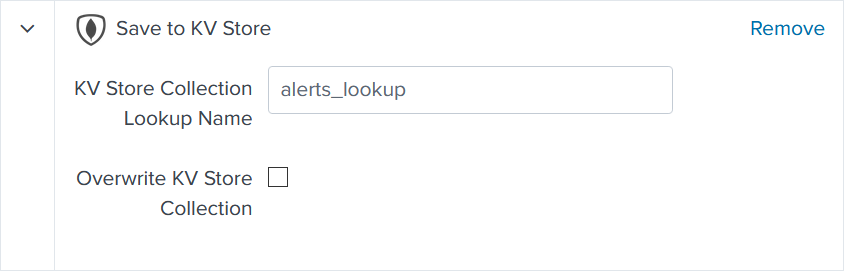

Alerts
======

Update KV Store lookup
######################

Its search query broken down in detailed steps:

Remove deleted alerts from the lookup
-------------------------------------

.. list-table::
   :widths: 20 80
   :header-rows: 1

   * - Lines
     - Description
   * - 1
     - Load KV Store lookup
   * - 2-5
     - Filter out active alerts to obtain the list of alerts to be removed from the KV Store lookup
   * - 6
     - Call KV Store lookup to get the ``_key`` field of each alert entry to be deleted
   * - 7
     - Delete alert entries from the lookup using `Gemini KV Store Tools <https://splunkbase.splunk.com/app/3536/#/details>`_ custom command

Search for active alerts
------------------------

.. list-table::
   :widths: 20 80
   :header-rows: 0

   * - 8-9
     - Search for all enabled and scheduled alerts, then for each alert:
   * - 11
     - Check if the index is specified in the search query, if applicable, using macro ``indexIsSpecified``
   * - 13-14
     - Define the owner as being the local-part of the first recipient email address
   * - 18
     - Clean ``updated`` field
   * - 19
     - Save the MD5 hash of the concatenation of main fields for later comparison

Considered fields
*****************

+-------------------+-----------------------------+
| Field             | Field Description           |
+===================+=============================+
| ``alert``         | alert name                  | 
+-------------------+-----------------------------+
| ``app``           | app name                    |
+-------------------+-----------------------------+
| ``updated``       | last update timestamp       | 
+-------------------+-----------------------------+
| ``cron_schedule`` | alert schedule              |
+-------------------+-----------------------------+
| ``earliest_time`` | search period earliest time |
+-------------------+-----------------------------+
| ``latest_time``   | search period latest time   |
+-------------------+-----------------------------+
| ``search``        | search query                |
+-------------------+-----------------------------+
| ``email``         | recipient email(s)          |
+-------------------+-----------------------------+
| ``actions``       | alert action(s)             |
+-------------------+-----------------------------+

Also save the md5 checksum of the search query.

.. list-table::
   :widths: 20 80
   :header-rows: 0

   * - 20-22
     - Use `Cron Iteration <https://splunkbase.splunk.com/app/4027/#/details>`_ command to calculate the interval between 2 executions
   * - 23-24
     - Prefix all fields name except ``alert`` & ``app`` with ``new_`` for later comparison
   * - 25-35
     - Determine the maximum runtime from scheduler logs
   * - 36
     - Filter out alerts only present in scheduler logs

Compare it to current KV Store lookup entries
---------------------------------------------

.. list-table::
   :widths: 20 80
   :header-rows: 0

   * - 37-38
     - Add the current content of the KV Store lookup to the results for comparison
   * - 39
     - Group both data sets (1-6 & 37-38) by ``alert`` and by ``app``
   * - 40
     - If the MD5 of main fields have changed or if runtime exceeds interval, keep the newest values
   * - 41
     - If the search period of schedule has changed, reset the *Alignment* check
   * - 42
     - If the search query has changed, reset the *Structure* check
   * - 43
     - If the search query has changed, reset the *Source* check
   * - 45
     - If the runtime exceeds the interval, update the *Runtime* check
   * - 46-47
     - Check if the search period has a minimum delay of 1 minute, if applicable
   * - 48-55
     - Fields clean up
   * - 56-59
     - Retrieve App label
   * - 60
     - Call KV Store lookup to get the ``_key`` field for each entry to update

Save results to the KV Store lookup
-----------------------------------

The output contains two types of entries:

- alerts created after the last execution of the alert
- alerts modified since the last execution of the alert

It is saved to the KV Store lookup **alerts_lookup** using Gemini KV Store Tools' custom alert action:

   
Save results to the KV Store lookup
-----------------------------------

Alert runs every hour. If you adjust cron schedule, adjust time range accordingly.

Notify admin for alerts to review
#################################

This alert notifies Splunk admins of the count of alerts that need to be reviewed.

The idea is to enable it after the first initial review of all alerts.

This way, Splunk admins get notified of any alert to review whether new of modified.

The recipient(s) must be set and the schedule should be adjusted to your needs.

Notify alert owner of a change 
##############################

This alert notifies the owner of an alert of any change made on an alert he owns.

The goal is to avoid any issue that could arise from unsolicited or unannounced modifications.

The recipient of this alert is the recipient of the modified alert.

If the alert has no recipient, alert is sent to email set in ``Notify admin for alerts to review`` alert.

Search query steps:

.. list-table::
   :widths: 20 80
   :header-rows: 1
   
   * - Lines
     - Description
   * - 1
     - Search for all enabled and scheduled alerts, then for each alert:
   * - 4
     - Clean ``updated`` field
   * - 5
     - Save the MD5 hash of the concatenation of main fields for later comparison (:ref:`see above<Considered fields>`)
   * - 6
     - Prefix all fields name except ``alert`` & ``app`` with ``new_`` for later comparison
   * - 8-11
     - Load KV Store lookup entries that do have an ``owner``
   * - 12
     - Group both data sets (1 & 8-11) by ``alert`` and by ``app``
   * - 13
     - Filter out results having the same MD5 hash of main fields in both data sets
   * - 16-21
     - Eval main alert fields to identify the modified ones
   * - 27-30
     - Retrieve App label
   * - 34-39
     - If email is invalid set it as set in ``Notify admin for alerts to review`` alert
