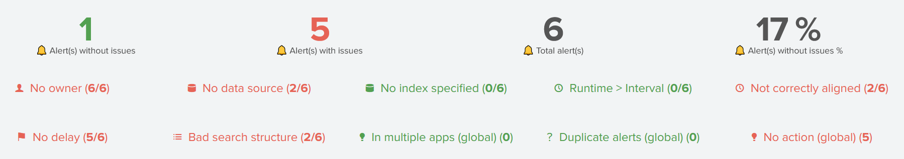
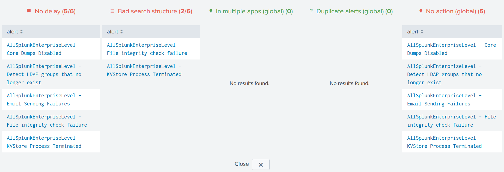

Browse KPIs
===========

Alert checks stats
------------------

``Issues`` dashboard is stats oriented.

Its purpose is to ease alert reviewing by tracking down its progression:

Stats can be shown by app, owner or even status, reviewed or not.

Click on a panel title to obtain the list of alerts related to each stat:

   
Use the ``Close`` button to hide the panel back.

Additional checks
-----------------

Besides stats on defined :hoverxref:`Alert checks<Alert Checks>`, 3 additional checks are provided:

.. list-table::
   :widths: 20 80
   :header-rows: 1

   * - Check
     - Description
   * - In multiple apps
     - The same alert is configured in multiple Apps
   * - Duplicate alerts
     - Several alerts share the same search query, schedule time and time range
   * - No action
     - Alert has no configured action
   * - Close names
     - Alerts with close names
     
.. admonition:: In multiple apps

   This is not a big issue since Splunk merges the parameters across different Apps 
   but it can lead to confusion when editing the alert so it should be fixed.

.. admonition:: Duplicate alerts

   As it might indicate a duplicate alert - same alert, different name - it should
   be checked.

.. admonition:: No action

   This check discards alerts whose action resides within the search query 
   (e.g. outputlookup). These alerts should be checked.
   
.. admonition:: Close names

   This check's purpose is to spot alert having very close names to check for duplicate alerts.

.. warning:: These additonal checks are global, meaning dashboard's top filters does not apply.

.. tip:: Click on an alert row to open it in the ``Inventory`` dashboard.
