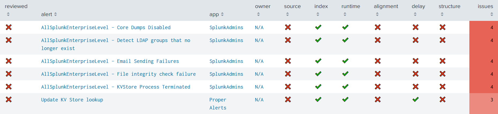
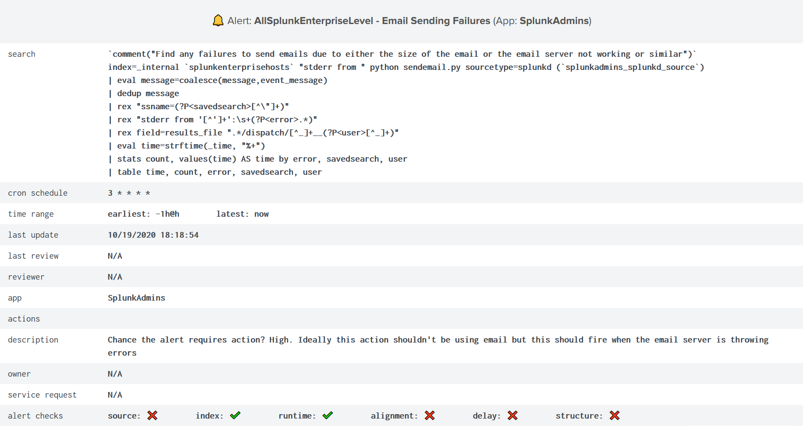

Review Alerts
-------------

Alert review happens from the ``Iventory`` dashboard.

Active alerts should be listed in the very first panel:

   
Some filters can be used to narrow down displayed alerts.

The ℹ️ button is a reminder of Alert Checks (link).

**Table details**

.. list-table::
   :widths: 40 60
   :header-rows: 1

   * - column
     - description
   * - reviewed
     - is the alert reviewed?
   * - alert
     - alert name
   * - app
     - alert app
   * - owner
     - owner of the alert
   * - source --> structure
     - is the check passed?
   * - issues
     - # of failed checks

To review an alert, click on its row to obtain its specifics:

Underneath, the ``Review alert`` section provides interactivre buttons.

🔍 --> alert's search query in a new tab

📊 --> alert actions from scheduler logs in a dynamic panel

⚙️ --> edit the alert in its App context in a new tab

🚀 --> reload results

.. admonition:: Reloading results

   If you have just edited the alert - to specify an ``index`` for instance -
   and you want the results to be refreshed right away, click 🚀 button as it 
   launches the ``Update KV Store lookup`` alert in the background.

Whether automatic checks are passed or not, you can then update manual checks (link) based on your review from the ``Update data`` section.

You can update manual check status in the KV Store lookup by clicking either on ✔️ or ❌

.. admonition:: Update buttons

   Update button for each manual check depends of its current status:
   - If it is currently failed and you want to review it as passed, click --> [check] ✔️
   - If it is currently passed and you want to review it as failed, click --> [check] ❌
   
   - If you want to mark it as reviewed, click --> Reviewed ✔️
   
   - If the owner is undefined, a dedicated text box lets you update it manually
   - If the service request is not available, a dedicated text box lets you update it manually

.. graphviz::

   digraph {
      "From" -> "To";
   }
