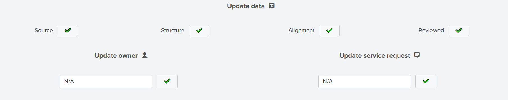

Review Alerts
-------------

Alert review happens from the ``Iventory`` dashboard.

Active alerts should be listed in the very first panel:

.. image:: img/inventory_panel_1.png
   :align: center
   
Some filters can be used to narrow down displayed alerts while the ℹ️ button is a reminder of Alert Checks (link).

**Table details**

.. list-table::
   :widths: 40 60
   :header-rows: 1

   * - column
     - description
   * - reviewed
     - is the alert reviewed?
   * - alert
     - alert name
   * - app
     - alert app
   * - owner
     - owner of the alert
   * - source --> structure
     - is the check passed?
   * - issues
     - # of failed checks

To review an alert, click on its row to obtain its specifics:

.. image:: img/inventory_panel_2.png
   :align: center

Underneath, the ``Review alert`` section provides interactivre buttons.

🔍 --> alert's search query in a new tab

📊 --> alert actions from scheduler logs in a dynamic panel

⚙️ --> edit the alert in its App context in a new tab

🚀 --> launch the ``Update KV Store`` alert

Update data

Once reviewed, it is time to update KV store lookup, if you want to change any value click buttpn

**(WARNING/2) Only the oposit value as the current one would be clickable ...**

.. admonition:: Changing the configuration file

   Extensions local to a project should be put within the project’s directory structure.
   Set Python’s module search path, sys.path, accordingly so that Sphinx can find them.
   E.g., if your extension foo.py lies in the exts subdirectory of the project root,
   put into conf.py::
   
      import sys, os
      sys.path.append(os.path.abspath('exts'))
      extensions = ['foo']
   
   You can also install extensions anywhere else on sys.path, e.g. in the site-packages directory.

Bonus owner update

.. graphviz::

   digraph {
      "From" -> "To";
   }

Search for a particular alert using filters + screen

Panel explain statuses + screen

Click an alert sreen ?

This opens another panel -> screen + eplain

Review: Explain each button 

Update: Explain each button

Bonus: Explain each button

What happens after an alert modification?
+++++++++++++++++++++++++++++++++++++++++

Workflow
