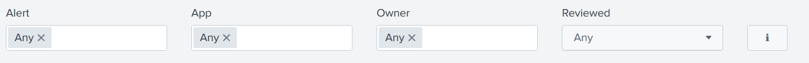
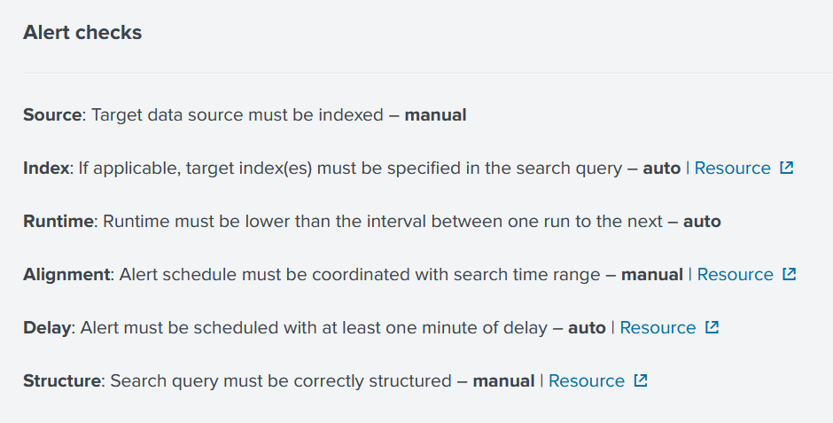
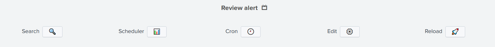

Review Alerts
-------------

Alert review happens from the ``Iventory`` dashboard.

Active alerts should be listed in the very first panel and you can use search filter to narrow results to a particular App for instance:

The ℹ️ button serves as a reminder for Alert Checks:

The panel has multiple columns

.. list-table::
   :widths: 40 60
   :header-rows: 1

   * - column
     - description
   * - reviewed
     - is the alert reviewed?
   * - alert
     - alert name
   * - app
     - alert app
   * - owner
     - owner of the alert
   * - source
     - source check
   * - index
     - index check
   * - runtime
     - runtime check
   * - alignment
     - alignement check
   * - delay
     - delay check
   * - structure
     - structure check
   * - issues
     - issues count out of 6

To review an alert, click on a row to drilldown to a new panel that provides more details on the selected alert:

.. image:: img/inventory_panel_2.png
   :align: center

Then the Review alert part provides interactivre buttons

The 🔍 button opens up alert's search query in a new tab.

The 📊 button opens a new panel that show scheduler logs as well as actions

The ⚙️ button opens a new tab in the App conext to edit the alert

If you edit the alert, for instance to specify an index, you might want to reload the 'update KV store lookup' so that new values are show, this happends from the 🚀 button

Update data

.. image:: img/inventory_update_data.png
   :align: center

Once reviewed, it is time to update KV store lookup, if you want to change any value click buttpn

**(WARNING/2) Only the oposit value as the current one would be clickable ...**

Bonus owner update

Search for a particular alert using filters + screen

Panel explain statuses + screen

Click an alert sreen ?

This opens another panel -> screen + eplain

Review: Explain each button 

Update: Explain each button

Bonus: Explain each button

What happens after an alert modification?
+++++++++++++++++++++++++++++++++++++++++

Workflow
