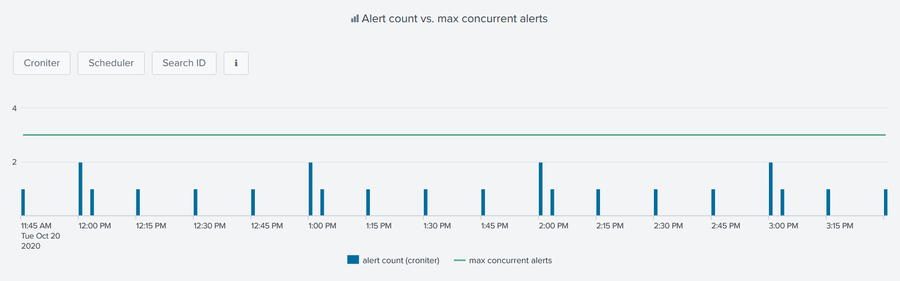

Address Spreading Issues
------------------------

Spreading issues are addressed in the :hoverxref:`Concurrency dashboard<Concurrency dashboard>`.

The first panel shows the number of alerts scheduled over time against the maximum number of concurrent shcedule searches that Splunk scheduler can run:

The idea is to spot too busy schedules and to set alerts on more diverse ones to avoid concurrency limit to be maxed out.

There are 3 versions of the dashboard, each having his own source for determining the number of alert running every minute.

Additional info is provided within the dashboard accessible from the ℹ️ button:

.. list-table::
   :widths: 30 70
   :header-rows: 1

   * - Data source
     - Info
   * - Croniter 
     - Python Cron Iteration for Splunk convert each alert schedule to a timestamp
   * - Scheduler 
     - Scheduled search log events
   * - Search ID
     - Search IDs events

.. tip:: As Croniter converts alerts' cron schedules to timestamps, any alert adjustment would be reflected right away.

Additional panels 

