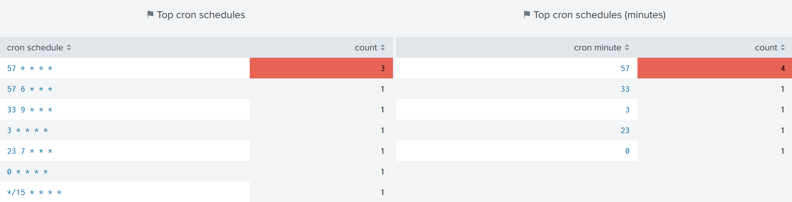

Improve Spreading
=================

Spreading issues are addressed in the :hoverxref:`Concurrency dashboard<Concurrency dashboard>`.

Concurrency limit
-----------------

The first panel shows the number of alerts scheduled over time against the maximum number of concurrent shcedule searches that Splunk scheduler can run:

The idea is to spot too busy schedules and to better spread alerts so that concurrency limit does not get maxed out.

There are 3 versions of the time chart, each having his own source for determining the number of alert running every minute.

Additional info is provided within the dashboard accessible from the ℹ️ button:

.. list-table::
   :widths: 30 70
   :header-rows: 1

   * - Time chart
     - Data source
   * - Croniter 
     - Python Cron Iteration for Splunk convert each alert schedule to a timestamp
   * - Scheduler 
     - Scheduled search log events
   * - Search ID
     - Search IDs events

.. tip:: As Croniter converts alerts' cron schedules in timestamps, any alert adjustment would be reflected right after the panel is refreshed.

Busiest schedules
-----------------

Additional panels underneath have the same purpose of spotting busy schedules by showing the most used ones:

.. tip:: Clicking on a cron schedule would open a new panel with matching alerts which can then be clicked again to open alert's edit page.
